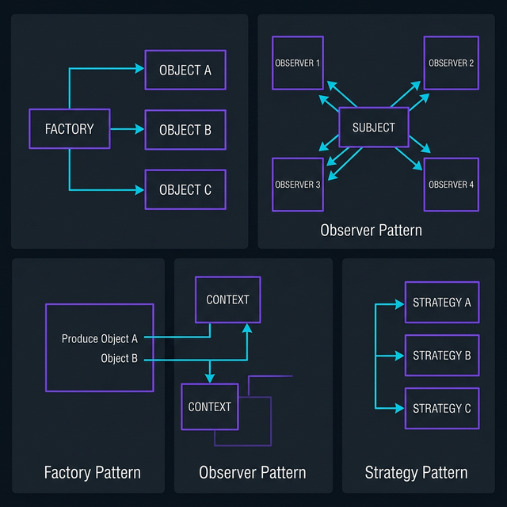

Design patterns are battle-tested solutions to recurring problems in software design. You don't need to memorize all 23 Gang of Four patterns — but knowing the essential ones will make you a significantly better engineer.


Here are the patterns I use most in production systems, with practical examples that go beyond textbook definitions.

---

## 1. Factory Pattern — "Don't `new` Things Directly"

The Factory pattern delegates object creation to a separate method or class, so your code doesn't need to know the exact class it's creating.

### Why It Matters

Imagine you're building an AI system that needs to support multiple LLM providers — Claude, GPT-4, and Gemini. Without a factory, every place you create a provider is tightly coupled:

```python
# ❌ Bad — tightly coupled
if provider_name == "claude":
    client = ClaudeClient(api_key=key, model="claude-3")
elif provider_name == "gpt4":
    client = OpenAIClient(api_key=key, model="gpt-4")
elif provider_name == "gemini":
    client = GeminiClient(api_key=key, model="gemini-pro")
```

With a factory, creation logic lives in one place:

```python
# ✅ Good — Factory pattern
class LLMFactory:
    _providers = {
        "claude": ClaudeClient,
        "gpt4": OpenAIClient,
        "gemini": GeminiClient,
    }

    @classmethod
    def create(cls, provider: str, **kwargs) -> LLMClient:
        if provider not in cls._providers:
            raise ValueError(f"Unknown provider: {provider}")
        return cls._providers[provider](**kwargs)

# Usage — clean and extensible
client = LLMFactory.create("claude", api_key=key, model="claude-3")
```

### When to Use It

- You need to create objects without specifying their exact class
- You want to centralize complex creation logic
- You need to swap implementations easily (testing, A/B experiments)

---

## 2. Observer Pattern — "Notify Everyone Who Cares"

The Observer pattern lets objects subscribe to events and get notified when something changes — without the publisher knowing who's listening.

### Real-World Example

In a monitoring system, when a deployment completes, multiple systems need to react:

```python
class EventBus:
    def __init__(self):
        self._subscribers: dict[str, list[Callable]] = {}

    def subscribe(self, event: str, callback: Callable):
        self._subscribers.setdefault(event, []).append(callback)

    def publish(self, event: str, data: dict):
        for callback in self._subscribers.get(event, []):
            callback(data)

# Set up observers
bus = EventBus()
bus.subscribe("deploy.complete", send_slack_notification)
bus.subscribe("deploy.complete", update_dashboard)
bus.subscribe("deploy.complete", run_smoke_tests)
bus.subscribe("deploy.failed", page_oncall_engineer)

# Publisher doesn't know or care who's listening
bus.publish("deploy.complete", {"service": "api", "version": "2.1.0"})
```

### When to Use It

- Multiple components need to react to the same event
- You want loose coupling between event producers and consumers
- Building notification systems, event-driven architectures, or UI state management

---

## 3. Strategy Pattern — "Swap Algorithms at Runtime"

The Strategy pattern lets you define a family of algorithms, put each in its own class, and make them interchangeable.



### Real-World Example

Different documents need different chunking strategies for a RAG pipeline:

```python
from abc import ABC, abstractmethod

class ChunkingStrategy(ABC):
    @abstractmethod
    def chunk(self, text: str) -> list[str]:
        pass

class FixedSizeChunking(ChunkingStrategy):
    def __init__(self, size: int = 512, overlap: int = 50):
        self.size = size
        self.overlap = overlap

    def chunk(self, text: str) -> list[str]:
        chunks = []
        for i in range(0, len(text), self.size - self.overlap):
            chunks.append(text[i:i + self.size])
        return chunks

class SemanticChunking(ChunkingStrategy):
    def chunk(self, text: str) -> list[str]:
        # Split on paragraph boundaries for semantic coherence
        return [p.strip() for p in text.split("\n\n") if p.strip()]

class DocumentProcessor:
    def __init__(self, strategy: ChunkingStrategy):
        self.strategy = strategy

    def process(self, document: str) -> list[str]:
        return self.strategy.chunk(document)

# Swap strategies without changing the processor
processor = DocumentProcessor(SemanticChunking())
chunks = processor.process(long_document)
```

### When to Use It

- You have multiple algorithms for the same task
- You want to switch behavior at runtime based on context
- You're building configurable pipelines (data processing, ML, ETL)

---

## 4. Singleton Pattern — "One Instance to Rule Them All"

The Singleton pattern ensures a class has exactly one instance and provides a global access point to it.

### When It's Actually Useful

Database connection pools, configuration managers, and logging services are legitimate Singleton use cases:

```python
class DatabasePool:
    _instance = None

    def __new__(cls):
        if cls._instance is None:
            cls._instance = super().__new__(cls)
            cls._instance._pool = create_connection_pool(
                host="db.example.com",
                max_connections=20
            )
        return cls._instance

    def get_connection(self):
        return self._pool.acquire()

# Both references point to the same pool
db1 = DatabasePool()
db2 = DatabasePool()
assert db1 is db2  # True — same instance
```

### ⚠️ The Singleton Warning

Singletons are heavily overused. Before reaching for one, ask yourself:

- **Could I use dependency injection instead?** (Usually yes, and it's more testable)
- **Am I using this as a global variable?** (That's a code smell)
- **Will this make testing harder?** (Singletons carry state between tests)

In modern Python, I prefer module-level instances or dependency injection over the classic Singleton pattern.

---

## Cheat Sheet

| Pattern | Problem It Solves | Key Signal |
|---------|------------------|------------|
| **Factory** | Complex object creation | `if/elif` chains creating objects |
| **Observer** | Multiple reactions to events | Several components watching for changes |
| **Strategy** | Swappable algorithms | `if/elif` chains choosing behavior |
| **Singleton** | Exactly one shared instance | Resource pools, config, logging |

## What About the Rest?

These four cover probably 70% of the patterns I use day-to-day. Other patterns worth learning next:

- **Decorator** — Add behavior to objects dynamically (Python has this built-in with `@decorators`)
- **Adapter** — Make incompatible interfaces work together
- **Builder** — Construct complex objects step by step

The best way to learn patterns isn't memorization — it's recognizing the problems they solve in your own code. Next time you see a messy `if/elif` chain or tightly coupled components, that's your signal.

---

*Have a favorite pattern I didn't cover? [Let me know on LinkedIn](https://linkedin.com/in/rohit-marathe-ucf).*
