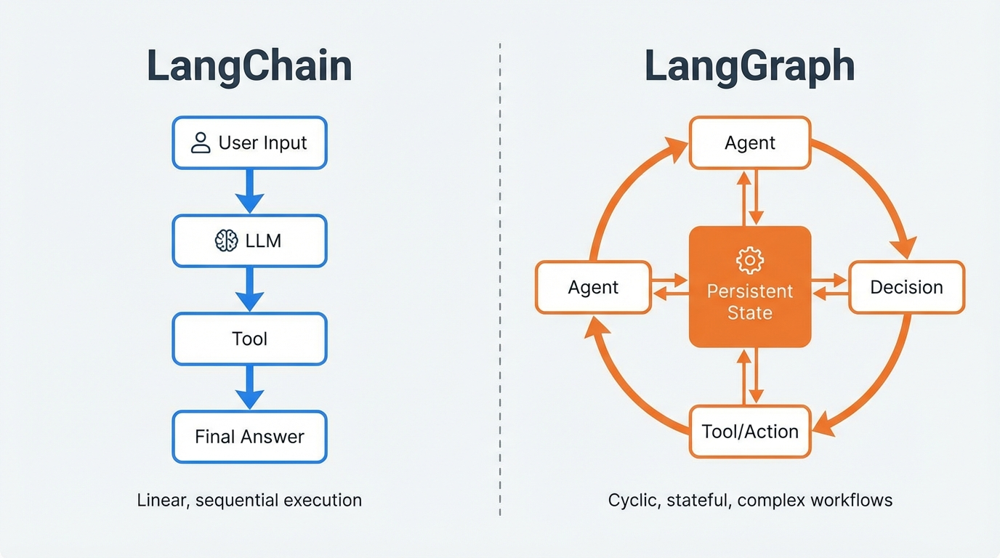

The landscape of building LLM-powered applications is evolving rapidly. We've moved from simple prompt engineering to complex "chains," and now we're entering the era of truly agentic, multi-agent systems.

When you're architecting these systems, the choice between **LangChain** and **LangGraph** is critical. While they share a lineage, their architectural foundations are built for fundamentally different use cases.

## The Architectural Divide

At its core, the difference is one of topology: **Linear Chains vs. Cyclic Graphs.**

### LangChain: The Linear Evolution

LangChain is built around the concept of a **Directed Acyclic Graph (DAG)**. You define a sequence of steps—a "chain"—where data flows from one component to the next in a predetermined, linear path.

- **Best for:** Straightforward transformations, simple RAG (Retrieval-Augmented Generation), and predictable task sequences.
- **The Limit:** Once you need an agent to "loop back" (e.g., to retry a tool call with corrected parameters), the linear chain pattern starts to break down. You end up with complex logic outside the chain to manage these cycles.

### LangGraph: The Agentic Revolution

LangGraph is designed specifically for **stateful, cyclic workflows**. Instead of a fixed sequence, you define a graph where nodes represent actions (like LLM calls or tool executions) and edges define the transitions between them.

- **Best for:** Complex agentic systems, multi-agent collaboration, and long-running workflows that require persistence.
- **The Power:** LangGraph treats **cycles** as first-class citizens. An agent can loop back to a previous node based on a decision, enabling a much more dynamic and resilient execution flow.

## State Management: Implicit vs. Explicit

One of the most significant differences lies in how these frameworks handle state.

### LangChain: Simple Memory
In traditional LangChain, state is often handled through "Memory" objects (like `ConversationBufferMemory`) that simply append history to the prompt. It’s effective for chat history but less so for complex, multi-step agent logic where you need to track specific variables across many turns.

### LangGraph: Explicit State and Checkpoints
LangGraph introduces an **explicit state schema**. You define exactly what data is being passed between nodes. More importantly, LangGraph includes built-in **persistence (Checkpoints)**. 

- **Checkpoints:** At every step, the graph's state is saved. This means if a system crashes or an agent needs to pause for human input, you can resume exactly where you left off.
- **Time Travel:** Because state is checkpointed, you can "rewind" the agent's execution to a previous step, inspect the state, or even branch out into a different path.

## Multi-Agent Coordination

When you scale to multiple agents working together, LangGraph shines.

1. **Collaborative Patterns:** You can have multiple nodes, each representing a specialized agent (e.g., a "Researcher" and a "Writer"), sharing a common state and passing control back and forth.
2. **Hierarchical Orchestration:** One "Manager" agent can delegate tasks to various specialized "Worker" agents, collecting their results and making higher-level decisions.

## Choosing the Right Tool

- **Choose LangChain** if your workflow is a clear, step-by-step process where each step's output is the next step's input. It’s faster to prototype and easier to reason about for simple tasks.
- **Choose LangGraph** if your application needs to handle complex decisions, requires cycles/looping, or needs to maintain a persistent state over long-running interactions. It provides the control and reliability needed for production-grade agentic systems.

The future of AI isn't just about more powerful models—it's about the sophisticated architectures we build around them. Understanding when to use a chain and when to use a graph is the first step toward building truly intelligent systems.

---
*About the author: Rohit Marathe is an AI Systems Engineer specializing in multi-agent orchestration and large-scale LLM deployments.*
