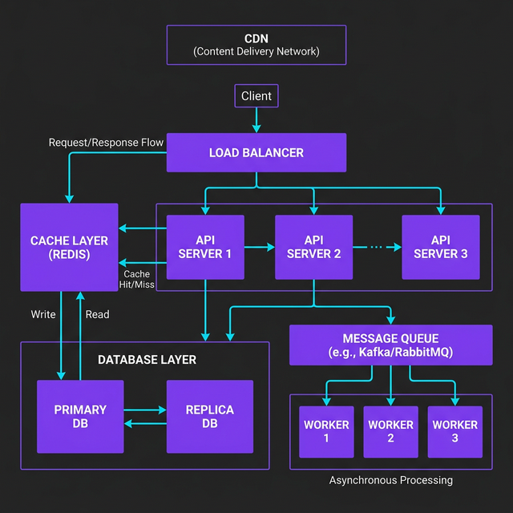

System design interviews can feel overwhelming, but every complex system is built from the same fundamental components. Once you understand these building blocks, you can reason about any architecture.


This post covers the core components you'll see in every system design — with practical explanations of *why* each exists and *when* to use it.

---

## The Big Picture

Before diving into individual components, here's how they fit together in a typical web-scale system:



Every request flows through this chain. Let me break down each component.

---

## 1. Load Balancer — "Distribute the Traffic"

A load balancer sits in front of your servers and distributes incoming requests across multiple instances. It's the reason Netflix doesn't crash when 100 million people hit play at 8 PM.

### How It Works

```
Client Request
      ↓
┌─────────────────┐
│  Load Balancer   │
└─────────────────┘
   ↓      ↓      ↓
Server1 Server2 Server3
```

### Common Algorithms

| Algorithm | How It Works | Best For |
|-----------|-------------|----------|
| **Round Robin** | Requests rotate through servers in order | Equal-capacity servers |
| **Least Connections** | Sends to the server with fewest active connections | Varying request complexity |
| **IP Hash** | Same client IP always goes to same server | Session persistence |
| **Weighted** | More traffic to beefier servers | Mixed hardware |

### Key Insight

Load balancers also handle **health checks** — they stop sending traffic to unhealthy servers automatically. This is how you achieve high availability without manual intervention.

```python
# Simplified health check logic
class LoadBalancer:
    def __init__(self, servers: list[Server]):
        self.servers = servers

    def get_healthy_server(self) -> Server:
        healthy = [s for s in self.servers if s.health_check()]
        return min(healthy, key=lambda s: s.active_connections)
```

---

## 2. Caching — "Don't Compute the Same Thing Twice"

Caching stores frequently accessed data in fast storage (usually memory) to avoid hitting slower databases or APIs repeatedly.

### Cache Tiers

```
Request → L1 (In-Memory, ~1ms) → L2 (Redis, ~5ms) → Database (~50ms)
```

### Cache Strategies

**Cache-Aside (Lazy Loading)** — The most common pattern:

```python
async def get_user(user_id: str) -> User:
    # 1. Check cache first
    cached = await redis.get(f"user:{user_id}")
    if cached:
        return User.from_json(cached)

    # 2. Cache miss — fetch from database
    user = await db.query("SELECT * FROM users WHERE id = ?", user_id)

    # 3. Store in cache for next time (expire in 5 minutes)
    await redis.set(f"user:{user_id}", user.to_json(), ex=300)

    return user
```

**Write-Through** — Write to cache and database simultaneously:

```python
async def update_user(user_id: str, data: dict):
    # Write to both — cache is always fresh
    await db.update("users", user_id, data)
    await redis.set(f"user:{user_id}", json.dumps(data), ex=300)
```

### Cache Invalidation

> *"There are only two hard things in Computer Science: cache invalidation and naming things."* — Phil Karlton

Common invalidation strategies:

| Strategy | Mechanism | Trade-off |
|----------|-----------|-----------|
| **TTL (Time-to-Live)** | Expires after N seconds | Simple but stale reads possible |
| **Event-based** | Invalidate on write events | Fresh data but more complex |
| **Version-based** | Key includes version number | Precise but coordination needed |

---

## 3. Database — "Where the Truth Lives"

### SQL vs NoSQL — The Real Decision Framework

Don't pick your database based on hype. Pick it based on your access patterns:

| Choose **SQL** When | Choose **NoSQL** When |
|-------|---------|
| Data has relationships (joins) | Data is denormalized/nested |
| You need ACID transactions | You need horizontal scaling |
| Schema is well-defined | Schema evolves rapidly |
| Complex queries needed | Simple key-value lookups |

### Database Scaling Patterns

**Read Replicas** — Scale reads by copying data to replica databases:

```
Writes → Primary DB
Reads  → Replica 1, Replica 2, Replica 3
```

This is the first scaling move most systems make. It works because most applications are read-heavy (~90% reads, ~10% writes).

**Sharding** — Split data across multiple databases by a key:

```
Users A-M → Shard 1
Users N-Z → Shard 2
```

⚠️ **Warning:** Sharding adds massive complexity. Don't shard until you absolutely have to. A single well-optimized Postgres instance can handle millions of rows.

---

## 4. Message Queue — "Do It Later"

Message queues decouple producers from consumers, letting you process work asynchronously.

### Why Queues Matter

Without a queue, if your email service is slow, your entire API slows down:

```
# ❌ Synchronous — user waits for email to send
POST /signup → Create User → Send Email → Return 200
                                  ↑
                         Slow! (2-5 seconds)
```

With a queue, the API returns instantly:

```
# ✅ Asynchronous — user gets instant response
POST /signup → Create User → Push to Queue → Return 200
                                     ↓
                        Worker picks up → Sends Email
```

### Queue Pattern in Practice

```python
# Producer — API server
async def handle_signup(request):
    user = await create_user(request.data)

    # Don't send email now — push to queue
    await queue.publish("emails", {
        "type": "welcome",
        "to": user.email,
        "name": user.name,
    })

    return {"status": "created"}  # Returns in ~50ms

# Consumer — Background worker
async def email_worker():
    async for message in queue.subscribe("emails"):
        await send_email(
            to=message["to"],
            template=message["type"],
            data=message,
        )
```

### When to Use Queues

- Sending emails/notifications
- Processing images/videos
- Syncing data between services
- Any work that doesn't need an immediate response

---

## 5. CDN — "Serve Content Close to Users"

A Content Delivery Network caches your static content (images, CSS, JS) on servers worldwide, so users download from a nearby server instead of your origin.

### Impact

```
Without CDN:  User in Tokyo → Server in Virginia → 200ms latency
With CDN:     User in Tokyo → CDN edge in Tokyo → 20ms latency
```

That's a **10x improvement** just by putting a CDN in front of your static assets.

### What to Put on a CDN

- ✅ Images, videos, fonts
- ✅ CSS and JavaScript bundles
- ✅ Static HTML pages
- ✅ API responses that rarely change
- ❌ User-specific dynamic content
- ❌ Real-time data

---

## Putting It All Together

Here's how these components work for a real system — let's say a social media feed:

1. **CDN** serves profile images and static assets
2. **Load Balancer** routes API requests across server instances
3. **API Servers** handle business logic
4. **Cache (Redis)** stores pre-computed feeds and session data
5. **Database** stores users, posts, and relationships
6. **Message Queue** handles async work — push notifications, feed updates, email digests

### Scaling Checklist

When your system needs to scale, follow this order:

1. **Add caching** (biggest bang for buck)
2. **Add read replicas** (scale reads)
3. **Add a CDN** (offload static content)
4. **Add message queues** (decouple and go async)
5. **Add more app servers + load balancer** (horizontal scaling)
6. **Shard the database** (last resort — high complexity)

---

## Key Takeaways

| Component | One-Line Summary |
|-----------|-----------------|
| **Load Balancer** | Distributes traffic, enables horizontal scaling |
| **Cache** | Stores hot data in memory, reduces database load |
| **Database** | Persistent storage — pick SQL or NoSQL based on access patterns |
| **Message Queue** | Decouples services, enables async processing |
| **CDN** | Serves static content from edge locations near users |

The beauty of these building blocks is that they compose. Start simple — a single server with a database — and add components as your scale demands them. Every engineering decision is a trade-off, and the best architecture is the simplest one that meets your requirements.

---

*Next up: I'll dive deeper into database scaling patterns and when to actually shard. [Follow me on LinkedIn](https://linkedin.com/in/rohit-marathe-ucf) to stay updated.*
